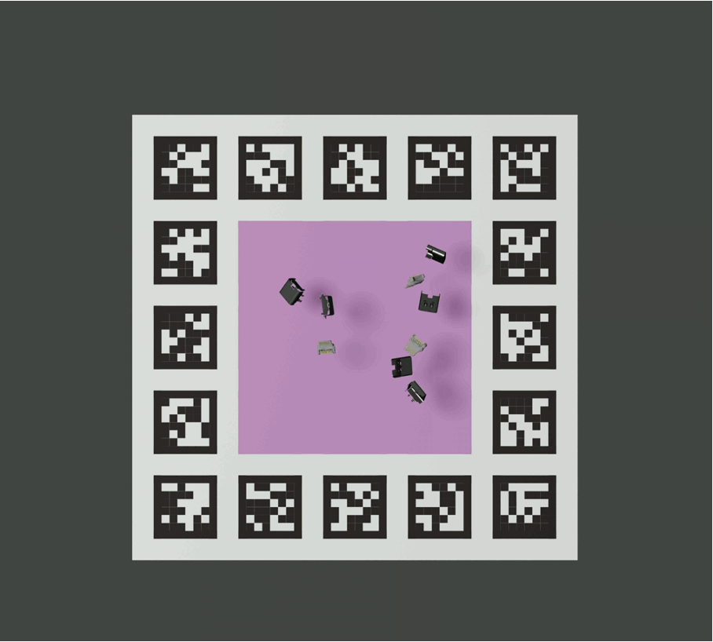

# StablePose_simulation
This repo aims to collect stable pose candidates for a given CAD models.

*NOTE:* Mass centers of objects have great impact on this experiment. In `Blender_proc2`, the definition of mass center is same as origin point of `.obj` file.
However, the origin point of `.obj` file is usually set to the center of the geometry by default, which is not mathching with real mass center. 
So, please make sure you have checked/updated the mass center of your `.obj` files before running the experiment. You may get the correct mass center information from original `.STP` files or other ways.


## Environment :atom:

*The following instructions assume that you have [anaconda][conda] installed and configured*

```
conda env create -f environment.yml
conda activate blender_proc
```

## Run Commands :rocket:	
Assume you have put all cad models(.obj) under PATH/TO/CAD/MODELS. Then run:

```
bash scripts/pose_exp PATH/TO/CAD/MODELS PATH/TO/OUTPUT/DIR
```
E.g.:  `bash scripts/pose_exp ./CAD_model/models ./pose_exp`

## Results processing :floppy_disk:
Please follow the guidline in [save_pose.ipynb](https://github.com/yangfei4/StablePose_simulation/blob/main/save_pose.ipynb).

## Render simulation process
Run the following script:
```
bash scripts/render_sim PATH/TO/CAD/MODELS PATH/TO/OUTPUT/DIR
```
E.g.:  `bash scripts/render_sim ./CAD_model/models ./pose_exp`
After running above command, a set of rendered images will be save in your output dictionary.
In sample script, we rendered first 20 frames of the simulation process as 20 .png images.

## Generate video from rendered images
```
python generate_video.py PATH/TO/IMAGES
```
E.g.:  `python generate_video.py ./pose_exp/images`



[conda]: https://docs.conda.io/projects/conda/en/latest/user-guide/install/index.html
